:page-partial:

[[bamm-cli]]
= BAMM CLI

The BAMM CLI is a command line tool for the validation of Aspect models and the generation of artifacts, such as
 documentation or code, from Aspect models.

TIP: Download latest version: icon:download[] https://github.com/OpenManufacturingPlatform/sds-sdk/releases/download/v{sds-sdk-version}/bamm-cli-{sds-sdk-version}.jar[bamm-cli-{sds-sdk-version}.jar]

== Preconditions
=== Step 1 - Java Download
The BAMM CLI SDK may be downloaded as an executable .jar or it may be built from the user individually. In case of an individual built a java development kit (JDK) is required. To run the java application a JRE is enough. 
You can download the JDK from https://adoptium.net/?variant=openjdk11&jvmVariant=hotspot[here].

image::../images/1_JDK_Download.png[]

=== Step 2 - Java Check
Ensure your Java version is up to date:
1.	Open a terminal or command line
2.	Enter “java -version”
3.	Check if result is identical to the downloaded version

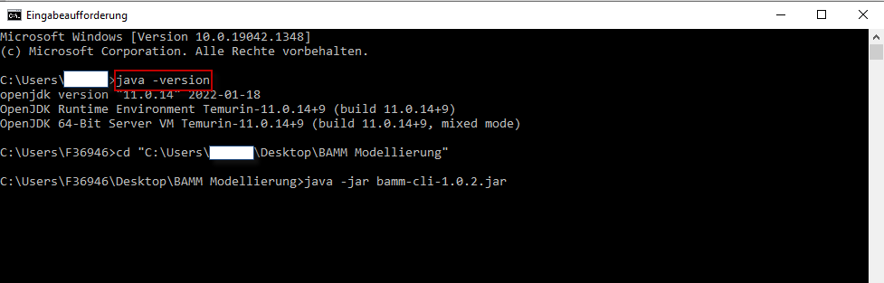

=== Step 3 - BAMM Download
Download the released https://github.com/OpenManufacturingPlatform/sds-sdk/releases[BAMM CLI SDK]

1. In case you want to run a built executable -> Download only the first file "bamm-cli-1.02.jar" (Note: Version number may change over time)
2. In case you want to build your own executable -> Clone the repository and build with https://maven.apache.org[Maven].

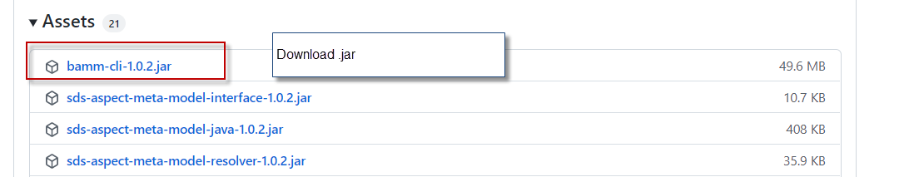

=== Step 4 - BAMM Placement
1. Create directory (e.g. on Desktop)
2. Place downloaded .jar file in the folder.

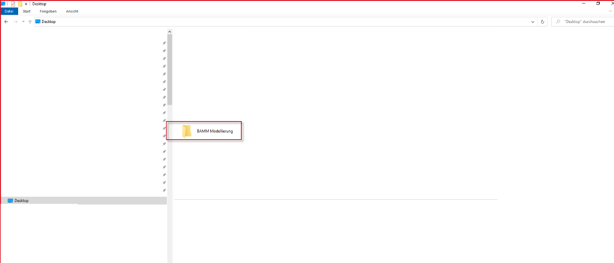

3. Also place example model in the corresponding folder. 
4. !Remember: the model file must be placed according to the URN-schema of your model.
In this example it's: @prefix : <urn:bamm:io.openmanufacturing:1.0.0#>. That implies the current position of the model is false.
The correct position in regards to <urn:bamm:io.openmanufacturing:1.0.0#> is as follows:

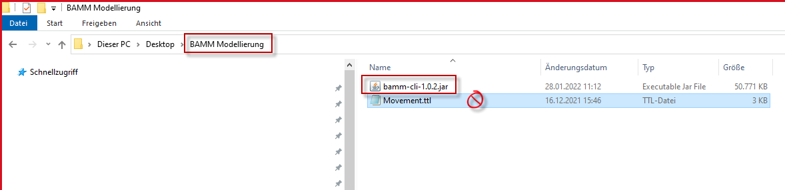

5. Correct folder: root folder > io > openmanufacturing > 1.0.0

image::../images/6_PlaceModelFiles.png[]

=== Step 5 - Run CLI
1.	Navigate to the folder which contains the downloaded .jar (e.g. bamm-cli-1.02.jar)
    a.	cd {path to folder}
2.	Start CLI
    a.	java -jar bamm-cli-1.02.jar
    b.	Positive feedback is the help manual

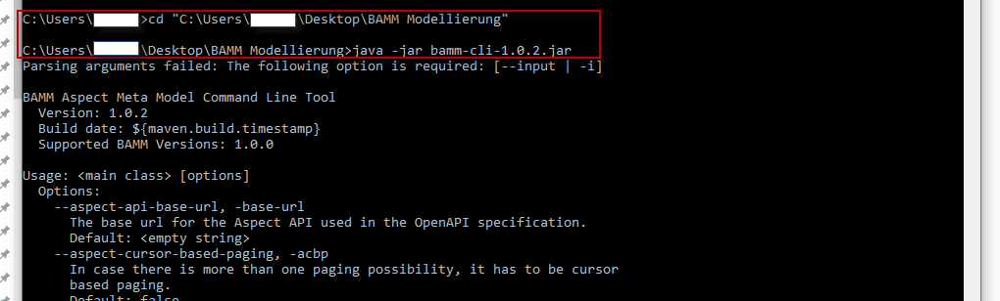

[[bamm-cli-getting-started]]
== Running the BAMM CLI

The basic way to run the tool is as follows:

[source,shell,subs="attributes+,+quotes"]
----
java -jar bamm-cli-{sds-sdk-version}.jar -i _AspectModel.ttl_ _switch_
----
where _switch_ is one of the following:

[width="100%", options="header", cols="40,60"]
|===
| Switch | Description
| `--validate` or `-v` | Validate the Aspect model
| `--generate-documentation` or `-html` | Generate HTML documentation
| `--generate-dot-diagram` or `-dot` | Generate diagram in https://www.graphviz.org/[Graphviz/DOT] format
| `--generate-java-classes` or `-java` | Generate Java domain classes (POJOs)
| `--generate-json-payload` or `-json` | Generate sample JSON payload
| `--generate-json-schema` or `-schema` | Generate JSON Schema
| `--generate-openapi-json` or `-oapi-json` | Generate OpenAPI JSON specification for an Aspect Model
| `--generate-openapi-yaml` or `-oapi-yaml` | Generate OpenAPI YAML specification for an Aspect Model
| `--generate-png-diagram` or `-png` | Generate diagram in PNG format
| `--generate-static-java-classes` or `-static-java` | Generate static meta classes
| `--generate-svg-diagram` or `-svg` | Generate diagram in SVG format
| `--migrate` or `-m` | Automatically migrate an Aspect model to the latest Meta Model version
| `--pretty-print` or `-p` | Print an Aspect model nicely formatted
|===

The following switches can be used in addition to the ones above to configure the generation:
[width="100%", options="header", cols="40,60"]
|===
| Switch | Description
| `--output-directory` or `-d` | Set the directory where files are written, defaults to the current directory. This
  applies to all switches that generate files.
| `--package-name` or `-pn` | Set the package name for generated Java files. This applies to `-java` and `-static-java`.
| `--disable-jackson-annotations` or `-dja` | This option is to be used together with `-java` or
  `-static-java` and will lead to generated Java code that does not contain
  https://github.com/FasterXML/jackson[Jackson] Annotations.
| `--execute-library-macros` or `-elm` | This option is used together with `-java` or `-static-java` and lead to generated Java code which includes the output from the custom macros provided via `-tlp` and `-tlfn`.
| `--template-library-file` or `-tlf` | The path and name of the template file containing custom macros.
It is used together with `-elm`.
| `--use-semantic-api-version` or `-sv` | This option is used together with `-oapi-json` or `-oapi-yaml` in order to use
  the complete semantic version of the Aspect Model as the version of the Aspect API.
| `--aspect-api-base-url` or `-base-url` | This option is used together with `-oapi-json` or `-oapi-yaml` to provide the
  base URL for the Aspect API OpenAPI specification.
| `--include-aspect-query-api` or `-query-api` | This option is used together with `-oapi-json` or `-oapi-yaml` to include
  the path for the Query Aspect API Endpoint in the OpenAPI specification.
| `--aspect-exclude-paging` or `-no-paging` | This option is used to exclude the paging information in the OpenAPI specification. Paging is per default activated.
| `--aspect-time-based-paging` or `-atbp` | This option is used to set the used paging strategy as time-based paging.
| `--aspect-offset-based-paging` or `-aobp` | This option is used to set the used paging strategy as offset-based paging.
| `--aspect-cursor-based-paging` or `-acbp` | This option is used to set the used paging strategy as cursor-based paging.
| `--aspect-resource-path` or `-arp` | This option is used together with `-oapi-json` or `-oapi-yaml` to set the resource-path`
  for the Aspect API endpoints.
| `--aspect-parameter-file` or `-apf` | This option is used together with `-oapi-json` or `-oapi-yaml` to set a file including
  the schema description for the resource. For JSON the description has to be in json, for YAML it has to be in YAML
|===

== Using the CLI to create a JSON OpenAPI Specification
Every specification is based on one Aspect, which needs a separately defined server URL where the given aspect will be.
The URL will be defined as string with the `-base-url` command, i.e.: https://www.example.org.
The default URL, using the above defined -base-url, would result in https://www.example.org/api/v1/\{tenantId}/<aspectName>.
By default the Aspect's local name is used as path. The default path can be manipulated with the `--aspect-resource-path` switch.
If the path is defined further, for example `--aspect-resource-path "/resources/\{resourceId}"`, the resulting URL would be: https://www.example.org/api/v1/\{tenantId}/resources/\{resourceId}.

It will be required to specify the parameter, in case there is an additional parameter defined.
This has to be in JSON or in YAML, depending on the kind of specification chosen.
For example:
With the option `--aspect-resource-path "/resources/\{resourceId}"` the generator constructs the URL https://www.example.org/api/v1/\{tenantId}/resources/\{resourceId}
and then the `--aspect-parameter-file` defines the parameter resourceId in yaml:
----
resourceId:
  name: resourceId
  in: path
  description: An example resource Id.
  required: true
  schema:
    type: string
----
The full command would result in:
[source,shell,subs="attributes+,+quotes"]
----
java -jar bamm-cli-{sds-sdk-version}.jar -i _AspectModel.ttl_ -oapi-yaml -baseUrl "https://www.example.org"
-arp "/resources/\{resourceId}" -apf _fileLocation_
----

[[models-directory-structure]]
== Understanding the models directory structure

An Aspect model file can contain an Aspect definition as well as other model elements that are defined in the same
versioned namespace, as described in the xref:bamm-specification:ROOT:namespaces.adoc[Namespaces section of the
specification]. Additionally, it is possible to split one versioned namespace across multiple files, for example to
define a Characteristic that is usable in multiple Aspects into its own file. In order for BAMM CLI to be able
to resolve references to such externally defined model elements, the model files must be organized in a directory
structure as follows:

`_namespace_/_version_/_name_.ttl`

where _namespace_ corresponds to the hierarchical namespace that is part of the model element's URN, e.g.
`com.mycompany.myproduct` and _version_ corresponds to the version of the namespace. The resulting directory structure
then looks like the following:

[source,subs=+quotes]
----
_models root_
└── com.mycompany.myproduct
    ├── 1.0.0
    │   ├── MyAspect.ttl
    │   ├── MyEntity.ttl
    │   └── myProperty.ttl
    └── 1.1.0
        └── MyAspect.ttl
----

The name of the directory shown as _models root_ above can be chosen freely. The BAMM CLI will resolve the file path
relative to the input file by following the folder structure described above. Each of the files in the `1.0.0` directory
should therefore have an empty prefix declaration such as `@prefix : <urn:bamm:com.mycompany.myproduct:1.0.0#>`.

[[Examples]]
== Running Examples
=== Validation
1.	Identify the path to the model which is to be validated (Note: Here, Movement.ttl as an example)

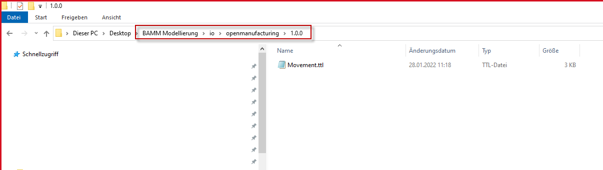

2.	Add further options to the CLI start including the path to the model. E.g Java -jar bamm-cli-1.02.jar -i  …io/openmanufacturing/1.0.0/Movement.ttl

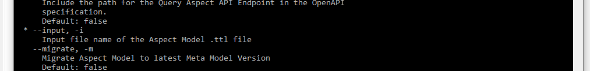

3.	Add other opens like -v to validate the model (Note: Only required in the validation example)

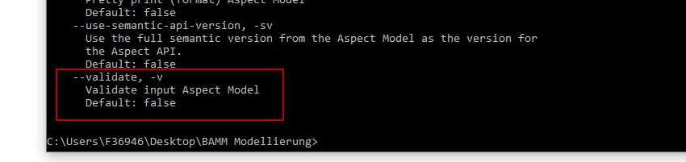

4. The full code and result looks as followed.

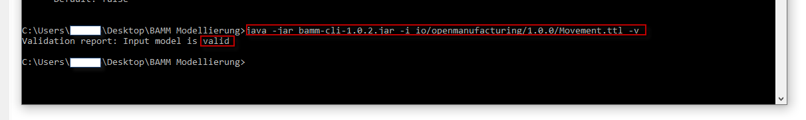

You could counter check it, by creating an invalid example first.
1. Open the Movement.ttl file 
2. Go to the first model row (beneath prefix rows) and remove ";" at the end of the row.
    Before: :Movement a bamm:Aspect;
    After: :Movement a bamm:Aspect
3. Save the file with a different name (e.g. MovementInvalid.ttl)

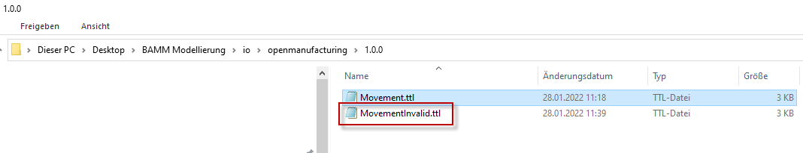

4. Run same code (with different file name) like above and see failed result

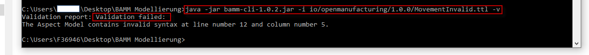

=== Creating an image or html
1. Pick a valid model file from your folder (e.g. Movement.ttl)
2. replace the command "-v" with "-png" and run the code

image::../images/14_PNGCommandResult.png[]

